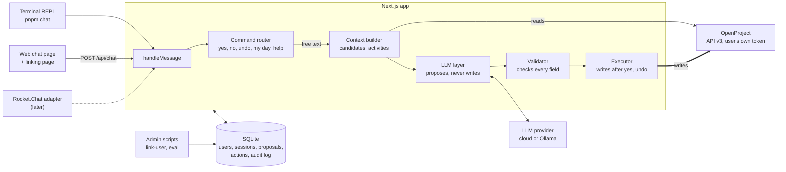
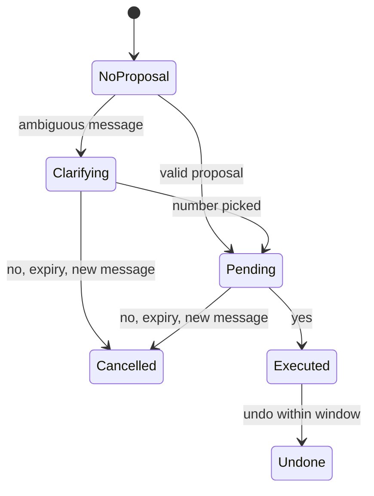

# Chat Bot PoC – Developer Handover

_Last updated: 2026-10-01_

## Purpose and context

Build a locally running proof of concept of a chat bot that lets staff log hours, add notes, change status and see their day in OpenProject by chatting, without opening OpenProject.

The company is a 15-person MSP. OpenProject Community (self-hosted, API v3) is the project management tool. For the PoC, users talk to the bot through a **web chat page** served by the app, and developers through a **terminal chat (REPL)**. The company's Rocket.Chat will be connected at a later stage as another channel; the design must make that a small addition.

Background lives in `project-context.md` and `poc-tech-stack.md`. This document is the build spec; where it is more specific than those files, follow this one.

## Scope

The PoC covers one conversation loop: interpret a message, propose a write, confirm, execute, and allow undo.

**In scope**

- **Combined update:** one free-text message becomes a proposal with any of a time entry, a comment and a status change on one work package.
- **Confirmation:** every write is shown to the user and executed only after an explicit yes. Proposals expire after 10 minutes.
- **Undo:** the user can reverse their last confirmed action within a configurable window (default 30 minutes).
- **My day:** a read-only list of the user's work packages for today, on request and shown when the web chat page opens.
- **Help:** a short list of what the bot understands.
- **Front ends:** a terminal REPL and a web chat page, both using the same bot core.
- **Per-user tokens:** each user links their OpenProject API token on a linking page; it is stored encrypted. An admin CLI exists as a fallback.
- **Audit log** of every inbound message, proposal, decision, write and error.
- **Evaluation script** for LLM accuracy.

**Out of scope (later stages)**

- Rocket.Chat integration, push messages such as a morning "my day" DM, and the worker process that sends them. See "Later: Rocket.Chat adapter".
- Docker or any containerisation.
- Creating work packages or projects, editing other users' assignments or dates, attachments.
- PostgreSQL, high availability, retry queues for OpenProject outages.
- Invoicing reports, reminders and other Phase 2 items.

## Fixed decisions and constraints

These are settled; do not change them without asking.

1. **Stack:** Next.js (App Router) with TypeScript in strict mode, on Node.js. No Docker. No worker process in the PoC.
2. **Channel-agnostic core.** All bot behaviour sits behind `handleMessage(ctx, text)` returning `BotReply[]`. Front ends (REPL, web, later Rocket.Chat) only resolve identity and render replies. No bot logic in front-end code.
3. **The LLM never writes.** It only returns a structured proposal. Writes to OpenProject happen in deterministic executor code, after the user confirms.
4. **Deterministic commands first.** "yes", "no", "undo", "my day" and "help" are matched by code before any LLM call. Only free text goes to the LLM.
5. **Closed candidate set.** The LLM may only target a work package from the candidate list built for that message. The executor rejects any ID not stored with the proposal.
6. **Bot text is built by code.** Confirmation and result messages are templates filled from validated data, never LLM-written text.
7. **Buttons are shortcuts for text.** Every button sends the same text a user could type ("yes", "no", "2"), so the flow works identically in channels without buttons.
8. **User's own token.** Every OpenProject call made for a user uses that user's token. There is no shared admin token for writes.
9. **Durations in code.** The LLM returns hours as a decimal number; the middleware converts to ISO 8601.
10. **State in SQLite**, never in memory.
11. **No destructive operations**, except deleting a time entry the bot itself created, as part of undo.
12. **Provider-agnostic LLM layer.** The provider and model are chosen by environment variables.
13. **Secrets:** tokens are encrypted at rest, never logged, never shown after entry. All dependency versions are pinned.

## Architecture and repository layout

One Next.js app holds the bot core, the web front end and the API; the REPL and scripts import the same core. Only the executor writes to OpenProject.



**Core types**

```typescript
type Channel = "web" | "repl" | "rocketchat";

interface MessageContext {
  userId: string;           // internal user ID (user_links.id)
  channel: Channel;
  clientMessageId: string;  // for deduplication
}

interface BotReply {
  text: string;                                     // plain text with light markdown
  actions?: { label: string; value: string }[];    // e.g. Confirm → "yes"
}

declare function handleMessage(ctx: MessageContext, text: string): Promise<BotReply[]>;
```

**Repository layout**

```text
poc-bot/
├─ app/
│  ├─ page.tsx                 # web chat (requires session)
│  ├─ link/page.tsx            # token linking page
│  └─ api/
│     ├─ chat/route.ts         # POST: message in, replies out
│     ├─ my-day/route.ts       # GET: "my day" on page open
│     ├─ link/route.ts         # POST: verify and store token, start session
│     ├─ logout/route.ts
│     └─ health/route.ts
├─ lib/
│  ├─ config.ts                # Zod-validated environment
│  ├─ db/                      # Drizzle schema and client
│  ├─ crypto.ts                # token encryption
│  ├─ session.ts               # web sessions
│  ├─ audit.ts
│  ├─ openproject/             # client, filters, durations, errors
│  ├─ llm/                     # provider factory, prompt, Proposal schema
│  └─ bot/                     # handleMessage, router, commands, context,
│                               # validate, proposals, execute, undo, messages
├─ scripts/                    # chat (REPL), link-user, unlink-user,
│                               # list-users, eval, op-smoke
├─ eval/messages.jsonl
├─ drizzle/                    # migrations
├─ tests/
├─ .env.example
└─ package.json
```

All logic lives in `lib/`. Pages, route handlers and scripts stay thin and import from it.

## Tech stack

Use the latest stable release of each item at project start and pin it.

| Area | Choice | Notes |
| --- | --- | --- |
| Runtime | Node.js, current Active LTS | |
| Package manager | pnpm | Commit the lockfile |
| Framework | Next.js, App Router | `next dev` locally; route handlers for the API |
| Language | TypeScript, `strict: true` | ESLint + Prettier |
| UI | React (via Next.js) + Tailwind CSS | One chat page and one linking page; keep it minimal |
| Database | SQLite via `better-sqlite3` | Single file, e.g. `./data/bot.db` |
| ORM and migrations | Drizzle ORM + drizzle-kit | Keeps a later PostgreSQL switch small |
| Validation | Zod | Env config, API bodies, LLM output |
| LLM layer | Vercel AI SDK (`ai`) | Structured output against a Zod schema; providers for Anthropic, OpenAI and Ollama |
| HTTP client | Native `fetch` | Thin typed wrapper for OpenProject |
| Scripts and REPL | `tsx` | REPL uses Node `readline` |
| Dates and time zones | `date-fns` + `date-fns-tz` | All "today" logic in `APP_TIMEZONE` |
| Encryption | Node `crypto`, AES-256-GCM | Key from `TOKEN_ENCRYPTION_KEY` |
| Logging | `pino` | Redact tokens, cookies and auth headers |
| Testing | Vitest + MSW | MSW mocks OpenProject and LLM HTTP calls |

## Configuration

All configuration comes from `.env.local` (git-ignored), validated by a Zod schema at startup; the app refuses to start on invalid config. Commit a `.env.example` with every variable and no secret values.

| Variable | Purpose | Example |
| --- | --- | --- |
| `APP_BASE_URL` | Public URL of the app, used for the `Origin` check | `http://localhost:3000` |
| `APP_TIMEZONE` | Time zone for "today", dates and schedules | `Europe/Athens` |
| `DATABASE_PATH` | SQLite file | `./data/bot.db` |
| `TOKEN_ENCRYPTION_KEY` | 32-byte key, base64 | (generated) |
| `SESSION_TTL_DAYS` | Lifetime of a web session | `30` |
| `OPENPROJECT_BASE_URL` | OpenProject instance | `https://op.example.local` |
| `OPENPROJECT_PROJECT_IDS` | Optional: restrict candidates to these projects (sandbox during development) | `12,15` |
| `LLM_PROVIDER` | `anthropic`, `openai` or `ollama` | `anthropic` |
| `LLM_MODEL` | Model name for that provider | (provider model ID) |
| `ANTHROPIC_API_KEY` / `OPENAI_API_KEY` | Cloud provider key, as needed | (secret) |
| `OLLAMA_BASE_URL` | Local model endpoint | `http://localhost:11434` |
| `PROPOSAL_TTL_MINUTES` | Expiry of unconfirmed proposals | `10` |
| `UNDO_WINDOW_MINUTES` | How long undo is allowed | `30` |
| `CANDIDATE_DAYS_BACK` / `CANDIDATE_DAYS_AHEAD` | Date window for candidate work packages | `7` / `1` |
| `MAX_DAYS_BACK_FOR_TIME` | Oldest allowed `spentOn` for a time entry | `7` |
| `BOT_COMMENT_SUFFIX` | Appended to comments written by the bot | `(via chat bot)` |
| `LOG_LEVEL` | pino level | `info` |

The time zone example is a placeholder; set it to the company's own.

## Data model

Six tables in SQLite, managed by Drizzle migrations. Timestamps are UTC ISO strings; JSON columns hold validated objects.

| Table | Columns | Purpose |
| --- | --- | --- |
| `user_links` | `id` (UUID), `display_name`, `op_user_id` (unique), `op_user_name`, `token_ciphertext`, `token_iv`, `token_tag`, `rc_user_id` (nullable, unique; for later), `active`, `created_at`, `updated_at` | Internal user mapped to an OpenProject user and encrypted token |
| `sessions` | `id_hash` (SHA-256 of the cookie value, primary key), `user_id`, `created_at`, `expires_at`, `last_seen_at` | Web chat sessions |
| `processed_messages` | `client_message_id` (primary key), `user_id`, `received_at` | Prevents double processing of the same submission |
| `proposals` | `id` (UUID), `user_id`, `channel`, `original_message`, `candidates_json`, `proposal_json`, `status` (clarifying, pending, confirmed, cancelled, expired, failed), `created_at`, `expires_at`, `resolved_at` | One open proposal per user; a new one replaces the old, which becomes cancelled |
| `executed_actions` | `id`, `proposal_id`, `user_id`, `kind` (time_entry, comment, status), `op_object_id`, `undo_json`, `executed_at`, `undone_at` | What was written and what is needed to reverse it |
| `audit_log` | `id`, `ts`, `user_id`, `channel`, `event`, `message_text`, `payload_json`, `api_response_json`, `error` | Append-only record of every step |

The `undo_json` contents depend on the action:

- **Time entry:** the created time entry ID.
- **Status change:** work package ID and the previous status href.
- **Comment:** work package ID and the activity ID of the comment.

Audit `event` values: `user_linked`, `message_received`, `command`, `proposal_created`, `clarification_asked`, `confirmed`, `cancelled`, `expired`, `executed`, `undone`, `my_day_shown`, `error`.

## Message handling flow

Every message, from any front end, goes through `handleMessage`, and each user has at most one open proposal at a time.

1. The front end resolves the user (web session or REPL `--user`) and generates a `clientMessageId`.
2. Deduplicate by `clientMessageId`; write `message_received` to the audit log.
3. Match commands: "yes", "no", "undo", "my day", "help", or a number while clarifying.
4. Anything else is free text: build the context, call the LLM, validate the proposal.
5. Store the proposal and reply with a clarification question or a confirmation message, each with actions.
6. On "yes", execute in a fixed order (time entry, then comment, then status), record undo data, and reply with the result.



A new free-text message replaces any open proposal. "no" and the 10-minute expiry also end a clarification. "yes" with nothing pending gets "Nothing to confirm". "my day" and "help" are answered in any state without changing it.

Undo reverses all actions of the user's last executed proposal, in reverse order, and reports each result.

**Example confirmation reply**

```text
Log this on #1234 File server installation (Client X)?
• Time: 2 h, On-site, today (Thu 1 Oct)
• Note: Replaced the PSU; server back online.
• Status: In progress → Closed
Reply yes or no.

actions: [Confirm → "yes"] [Cancel → "no"]
```

**Example result reply**

```text
Saved on #1234: 2 h logged, note added, status Closed.
Say "undo" within 30 minutes to reverse it.

actions: [Undo → "undo"]
```

## LLM contract

The LLM receives the user's message plus a context block and returns one object matching the schema below, via structured output (temperature 0). It makes no tool calls.

**Context sent with each message**

- Today's date and weekday in `APP_TIMEZONE`.
- Candidate work packages: ID, subject, project name, type, status, start and due date. At most 30, most relevant first.
- Time entry activities: ID and name (On-site, Remote, Travel).
- Status names the bot may propose (global list; per-work-package validity is checked later).

**Output schema (Zod)**

```typescript
const Proposal = z.object({
  kind: z.enum(["update", "clarify", "unrelated"]),
  workPackageId: z.number().int().nullable(),
  timeEntry: z.object({
    hours: z.number().positive().max(24),
    activityId: z.number().int().nullable(),
    spentOn: z.string(), // YYYY-MM-DD
  }).nullable(),
  note: z.string().max(4000).nullable(),
  statusName: z.string().nullable(),
  clarification: z.object({
    question: z.string(),
    optionWorkPackageIds: z.array(z.number().int()).max(3),
  }).nullable(),
});
```

**Prompt rules**

- Only use work package and activity IDs from the context. Never invent one.
- If no candidate clearly matches, or two are equally plausible, return `clarify` with up to three options.
- If an activity can't be inferred, return `activityId: null`; the bot asks the user to pick.
- Resolve relative dates ("yesterday", "Monday") against the given date. Default is today.
- `note` is the user's update rewritten as a clean work note in the user's language, keeping all facts and adding none.
- Messages may be in any language or mixed languages.

**Validation after the LLM (code, not the model)**

1. Zod parse succeeds.
2. `workPackageId` is in the stored candidate set.
3. `activityId` is in the activity list.
4. Hours are rounded to the nearest 0.25 and lie between 0.25 and 24.
5. `spentOn` is not in the future and not older than `MAX_DAYS_BACK_FOR_TIME`.
6. `statusName` maps to a status allowed for that work package by the form endpoint.
7. At least one of time entry, note or status is present.

If a check fails, the bot asks a specific follow-up question or explains why. It never silently drops part of the update.

## OpenProject client

A typed wrapper over API v3 at `{OPENPROJECT_BASE_URL}/api/v3`. Authenticate with HTTP Basic, username `apikey` and the user's token as password. Responses are HAL+JSON: links under `_links`, collections under `_embedded.elements`. Filters are passed as a JSON-encoded `filters` query parameter.

| Operation | Request | Notes |
| --- | --- | --- |
| Current user | `GET /users/me` | Used by the linking page and CLI to verify a token and store `op_user_id` |
| Candidate work packages | `GET /work_packages?filters=…&pageSize=50` | Assignee `me`, status open (`o`), dates overlapping the candidate window, optional project filter |
| My day | `GET /work_packages?filters=…` | Assignee `me`, status open, dates covering today; sort by project, then start date |
| Activities | `POST /time_entries/form` | Allowed values of `activity` in the returned schema; cache per project for 1 hour |
| Log time | `POST /time_entries` | Links to `workPackage` and `activity`; `hours` as ISO 8601 (1.5 → `PT1H30M`); `spentOn`; optional `comment.raw` |
| Delete time entry (undo) | `DELETE /time_entries/{id}` | Only IDs recorded in `executed_actions` |
| Add comment | `POST /work_packages/{id}/activities` | Body `{"comment": {"raw": "…"}}` plus `BOT_COMMENT_SUFFIX`; store the returned activity ID |
| Retract comment (undo) | `PATCH /activities/{id}` | Replace the text with "Retracted by the author via chat bot" |
| Read work package | `GET /work_packages/{id}` | Current `lockVersion` and status |
| Allowed statuses | `POST /work_packages/{id}/form` with `lockVersion` | Allowed values of `status` in the returned schema |
| Change status | `PATCH /work_packages/{id}` | Body includes `lockVersion` and `_links.status.href`; on 409, re-read once and retry |
| Revert status (undo) | `PATCH /work_packages/{id}` | Back to the stored previous status, with a fresh `lockVersion` |

**Error mapping**

| Status | Meaning | Bot reply |
| --- | --- | --- |
| 401 | Token invalid or revoked | Your OpenProject link needs renewing (web: link to the linking page) |
| 403 | Missing permission | You don't have permission for that in OpenProject |
| 404 | Not found or not visible | That work package can't be found anymore |
| 409 | Edit conflict after retry | Someone else just changed it; please try again |
| 422 | Validation error | Show OpenProject's message |
| 5xx or network | OpenProject unavailable | OpenProject isn't reachable right now; nothing was saved |

When a combined action partly fails, report exactly which parts were saved and which were not. Keep successful parts and record them for undo.

## Front ends

Both PoC front ends are thin: they resolve the user, call `handleMessage` and render `BotReply[]`.

**Terminal REPL: `pnpm chat --user <display name or user ID>`**

- Uses an already linked user (via the linking page or `pnpm link-user`).
- Prints each reply; actions are shown as hints, e.g. `[yes] Confirm  [no] Cancel`.
- Commands are typed exactly as in the web chat; there are no REPL-only commands.
- Logs go to a file, not the terminal, so the conversation stays readable.

**Web chat page (`/`)**

- Requires a session; without one, redirect to `/link`.
- On open, calls `GET /api/my-day` and shows today's work packages as the first bot message.
- Message list plus input box; actions render as buttons that send their `value` as a message.
- Sends `POST /api/chat` with `{ clientMessageId, text }` and renders `{ replies: BotReply[] }`. The call is synchronous; show a typing indicator while waiting and disable the input.
- Conversation history is kept in the page only (not persisted) for the PoC; the audit log is the record.
- Usable on a phone browser: one column, large buttons.

**Linking page (`/link`)**

- Explains where to create a token in OpenProject (My account → Access tokens) and has one field for it.
- `POST /api/link` verifies the token with `GET /users/me`, then creates or updates `user_links` (keyed by `op_user_id`), starts a session, and redirects to `/`.
- The token is never displayed or returned again. Re-linking replaces the stored token.
- `/api/logout` ends the session.

**Admin CLI (fallback):** `pnpm link-user --token <token>`, `pnpm unlink-user <user>`, `pnpm list-users` (no tokens shown).

## Later: Rocket.Chat adapter

Not part of the PoC, but the core must allow it without changes. Planned design, for reference:

- Outgoing webhook on "Message Sent" for DMs to a bot user, posting to `POST /api/rocketchat/webhook`; token checked in the route handler; deduplicate by Rocket.Chat `message_id` (used as `clientMessageId`).
- Respond `200` immediately and process in `after()`; reply via `chat.postMessage` with the bot's `X-User-Id` / `X-Auth-Token`.
- Map `user_id` to `user_links.rc_user_id`; unlinked users get a link to the web linking page.
- Render `actions` as text ("Reply yes or no").
- A worker process (`node-cron`) for push messages such as the morning "my day" DM, using `im.create` to open DM rooms.

## Security

- **Tokens:** AES-256-GCM with a random IV per token; decrypt only in memory for the duration of a request. Never log, print or return them, including in errors.
- **Token entry:** only on the linking page or the admin CLI, never through a chat message.
- **Sessions:** random 256-bit cookie value; only its SHA-256 hash is stored. Cookie is `httpOnly`, `SameSite=Lax`, and `Secure` everywhere except `localhost`.
- **CSRF:** all `POST` routes check that the `Origin` header matches `APP_BASE_URL`.
- **Logs:** pino redaction for `authorization`, `cookie`, `token` and `apiKey` fields.
- **Content:** if a note appears to contain a password or credential, the bot asks the user to remove it before proposing. A simple pattern check is enough for the PoC.
- **Exposure:** the app is reachable from the LAN only; no public endpoint.
- **Repository:** `.env.local` and `./data/` are git-ignored.

## Testing and evaluation

Three layers: unit and integration tests, manual end-to-end runs through the REPL and web page, and an accuracy evaluation of the LLM step.

**Unit and integration tests (Vitest + MSW)**

- Duration conversion, hour rounding, date resolution in `APP_TIMEZONE`.
- Command matching, including variants such as "y", "ok", "✅", "cancel", "❌".
- Proposal validation rules and the conversation state machine, including expiry and replacement.
- Executor: each action, partial failures, 409 retry, and every undo path.
- API routes: session required, `Origin` check, deduplication by `clientMessageId`, linking with a valid and an invalid token.

**Manual end-to-end**

The REPL drives full conversations against the sandbox OpenProject project from the first milestones on; the web page repeats the same scenarios once it exists.

**Evaluation: `pnpm eval`**

- Reads `eval/messages.jsonl`. Each line holds `userId`, `date`, `text` and the expected `workPackageId`, `hours`, `activityId`, `statusName` and `kind`.
- Runs context building and the LLM step only; it never writes.
- Reports accuracy per field and lists every mismatch, so models and prompts can be compared.
- Supports `--provider` and `--model` to benchmark cloud and local models on the same set.
- Start with 10 hand-written examples; the team will add 30–50 real ones before the pilot.

## Implementation milestones

Build in this order. Each milestone ends with passing tests and a short note of what was verified against the real OpenProject instance.

1. **Skeleton.** Next.js app, strict TypeScript, lint, Zod-validated config, Drizzle schema and first migration, `.env.example`.
   - Done when `pnpm dev`, `pnpm test` and `pnpm db:migrate` work on a clean checkout.
2. **OpenProject client and user linking (CLI).** Typed client, token encryption, `link-user`, `unlink-user`, `list-users`, plus `pnpm op:smoke` that lists a linked user's open work packages and activities.
   - Done when a real pilot token can be linked and the smoke script prints that user's data.
3. **Bot core and REPL.** `handleMessage` with deduplication and audit logging, `BotReply` rendering in the REPL.
   - Done when the REPL echoes messages and audit entries appear.
4. **Commands.** `help` and `my day` against the real OpenProject.
   - Done when "my day" lists the sandbox work packages correctly for today.
5. **Proposal flow.** Context builder, LLM layer, validation, clarification, the confirmation reply, open proposals with expiry and replacement.
   - Done when free-text updates produce correct confirmation replies in the REPL, with nothing written yet.
6. **Executor and undo.** Time entry, comment and status writes after "yes"; partial-failure reporting; undo for each action kind.
   - Done when each action and its undo work on the sandbox project via the REPL.
7. **Web front end.** Linking page, sessions, chat page with buttons and typing indicator, "my day" on open, logout.
   - Done when a pilot user can link their token and run every acceptance scenario in a browser, including on a phone.
8. **Evaluation and pilot readiness.** `pnpm eval` with the seed messages; run the app with `next build` + `next start` reachable on the LAN.
   - Done when the acceptance criteria below pass.

## Acceptance criteria

The PoC is ready for the pilot when all of these pass on the sandbox project with the real OpenProject instance.

- [ ] "2h on-site at the file server install, replaced the PSU, done" produces one confirmation showing work package, project, 2 h, On-site, today, the note and the status change.
- [ ] After "yes" (typed or button), the time entry, comment and status appear in OpenProject with the pilot user as author.
- [ ] "no" cancels; an unanswered proposal expires after 10 minutes and a later "yes" writes nothing.
- [ ] "undo" reverses the last confirmed action within the window and refuses after it.
- [ ] An ambiguous message gets a clarification question with numbered options, and replying with a number (or tapping it) continues the flow.
- [ ] "my day" and the web page's opening message list the right work packages for today.
- [ ] A visitor without a session is sent to the linking page; an invalid token is rejected and nothing is stored.
- [ ] A double-submitted message is processed once.
- [ ] The REPL and the web page give the same replies for the same messages.
- [ ] No token appears in logs, the database in plain text, any API response, or any reply.
- [ ] Every step of the above is visible in `audit_log`.
- [ ] `pnpm eval` runs on the seed set and reports per-field accuracy.

## Verify against the live instance

These details depend on the installed OpenProject version. Check each one early, adjust the code, and record the result here.

- [ ] Exact name and operator of the OpenProject filter for "dates overlap a range" (likely `datesInterval`), checked in the instance's interactive API docs.
- [ ] Whether `PATCH /activities/{id}` can edit a comment with the user's token, for comment undo.
- [ ] Whether the billable custom field on time entries is required, and if so, its default per activity.
- [ ] Request body and response shape of `POST /time_entries/form` and `POST /work_packages/{id}/form` on this version.
- [ ] Network: the dev machine can reach OpenProject over HTTPS; for the pilot, users' browsers can reach the app on the LAN.
- [ ] Sandbox project, pilot user accounts with tokens, and the MSP activity types exist in OpenProject.
